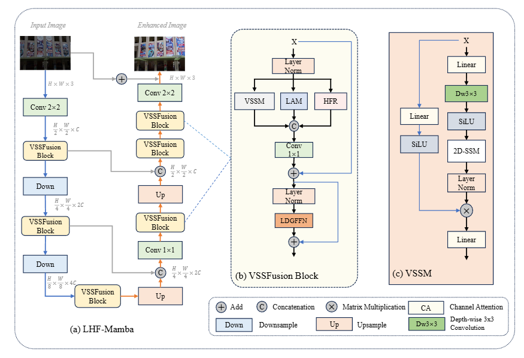
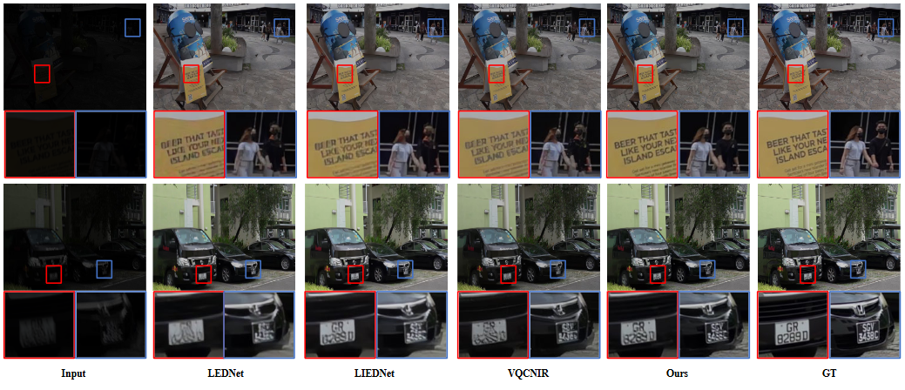
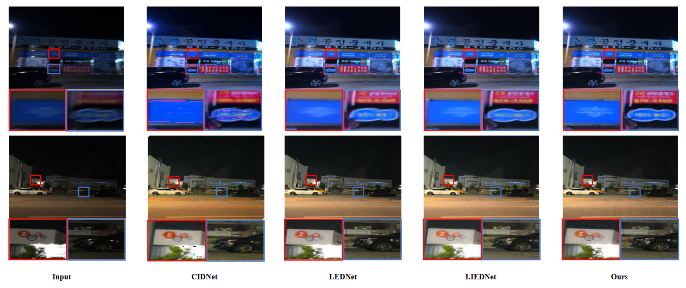
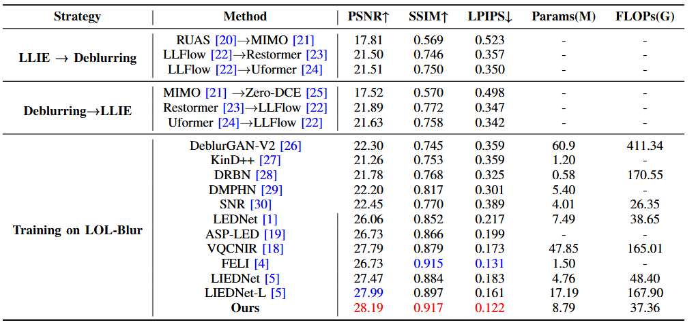
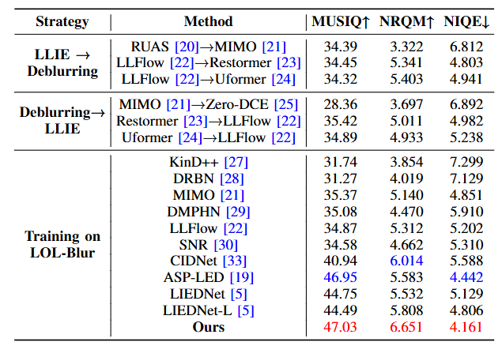

# MCBCG-Net: Multiscale Color-Brightness Dynamic Cross-Guided Dual-Branch Low-Light Image Enhancement Network

**Abstract:** Nighttime imaging is constrained by hardware limitations and often suffers from coupled degradation of low light and blurring. Existing research typically treats low-light enhancement and deblurring as separate tasks, while few joint optimization approaches face bottlenecks such as high model complexity, suboptimal performance, and limited generalization ability. To address this, this paper proposes a specialized model LHF-Mamba for the high-quality restoration of severely degraded low-light blurred images. Based on a lightweight three-branch fusion framework, the model integrates a Global Visual State Space Module (VSSM), a Luminance Awareness Module (LAM), and a High-Frequency Recovery Branch (HFR). To further adapt to our three-branch fusion architecture, we additionally design a Lightweight Dual-Branch Gated Feed-Forward Network (LDGFFN). Experimental results demonstrate that LHF-Mamba achieves leading restoration performance and computational efficiency on both synthetic and real-world low-light blurred datasets.

## Network Framework


## TODO

- [x] Testing Code & Checkpoint enhancement  
- [x] Model.py  
- [ ] Train.py  


## Quantitative Results

<details>
<summary>LOL-Blur:</summary>



</details>

<details>
<summary>Real-LOL-Blur:</summary>



</details>


## Qualitative Results. 


<details>
<summary>LOL-Blur and Real-LOL-Blur:</summary>



LOLv1 without GT mean:

</details>


## Dependencies and Installation

- Python >= 3.10
- Pytorch >= 1.13.1
- CUDA >= 11.6
- Other required packages in requirements.txt

``` python
conda create -n envname python=3.8
conda activate envname
pip install pytorch=1.13 
pip install -r requirements.txt
```
